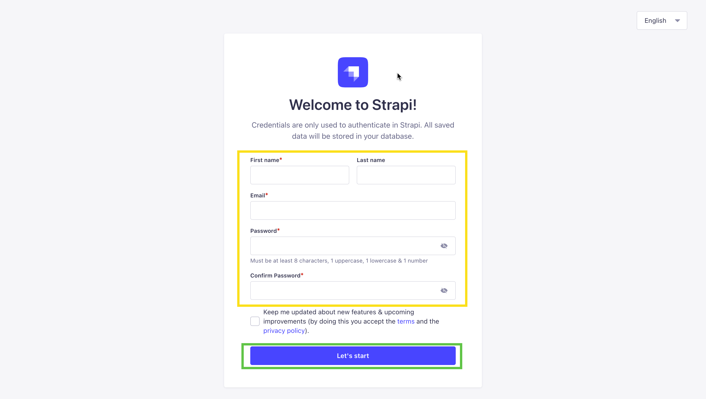
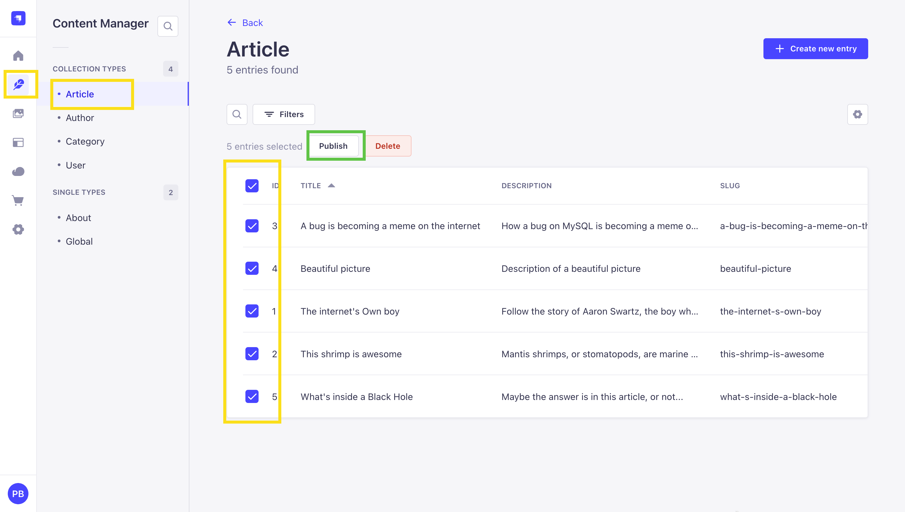
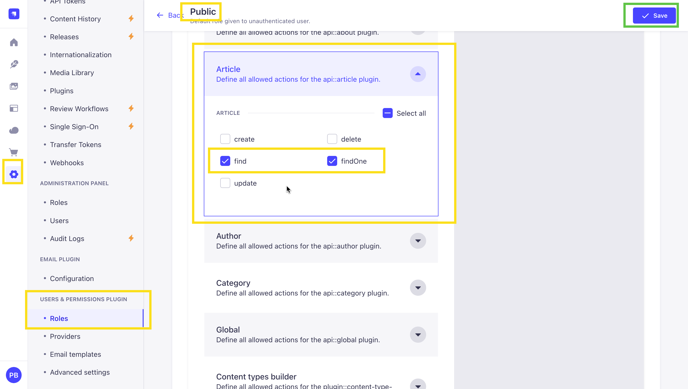
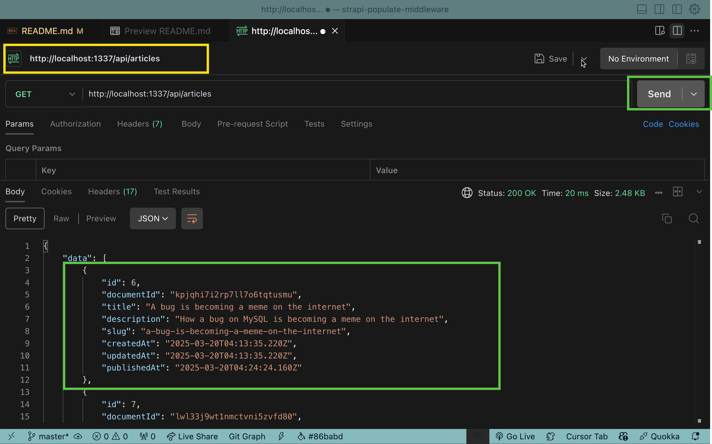
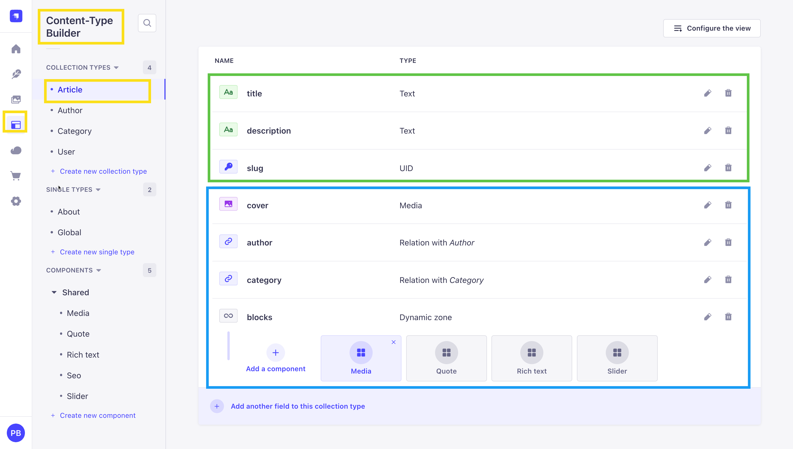
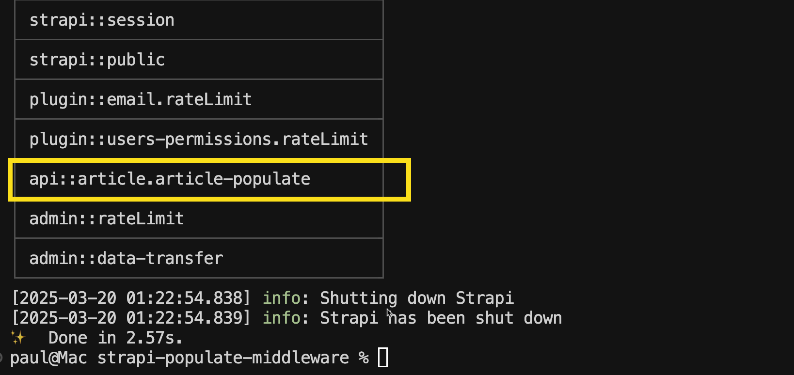

Learn how to set the default "populate" options via route middleware in Strapi 5.

Instead of passing "populate" on each request from the frontend, the can handle this functionality via route-based middleware in the backend. This will allow you to keep your frontend requests lean and organized.

You can also use this to control what data will be returned by default and not allow the user to add additional populate options in the frontend.

## What is Route Middleware?

In Strapi, Route Middleware has a more limited scope and is configured and used as middleware at the route level. You can [learn more in the Strapi documentation](https://docs.strapi.io/developer-docs/latest/development/backend-customization/routes.html#policies). Now, let's jump in and learn how to set this up.

## Sample Project Setup

Let's quickly set up a sample project to follow along. We will start by creating a new Strapi project with the following command:

```bash
  npx create-strapi-app@latest my-strapi-app
```

You will be prompted with the following questions, the first one will ask if you would like to login or sign up to Strapi Cloud, we will skip this by selecting `Skip`.

```bash
 ? Please log in or sign up. (Use arrow keys)
 Login/Sign up
 ❯ Skip
```

Next, you will be asked the following question:

```bash
? Do you want to use the default database (sqlite) ? Y
? Start with an example structure & data? Yes
? Start with Typescript? Yes
? Install dependencies with npm? Yes
? Initialize a git repository? Yes
```

note: Make sure you select `Yes` for Start with an example structure & data. This will give you some sample content to work with.

Once all the dependencies are installed, you will be able to start the Strapi server with the following command:

```bash
cd my-strapi-app
yarn develop
```

Once the server is running, you will be able to access the Strapi admin dashboard at `http://localhost:1337/admin`.

Go ahead and create your first **Admin User** so you can access the admin panel.



Once logged in, you will be redirected to the dashboard. Navigate to `Content Manager` and select **Article** collection type and let's publish the content so we can access it via the API.



Once published, before we can access the content, let's make sure that the API is enabled by going to `Settings` > `Users & Permissions plugin` > `Roles` > `Public`, selecting our **Article** collection type and enabling `find` and `findOne` permissions and save.



Now that is done, let's use **Postman** to query the content and see what we have.

We will make a `GET` request to `http://localhost:1337/api/articles` and we should see the following response:



```json
{
  "data": [
    {
      "id": 6,
      "documentId": "kpjqhi7i2rp7ll7o6tqtusmu",
      "title": "A bug is becoming a meme on the internet",
      "description": "How a bug on MySQL is becoming a meme on the internet",
      "slug": "a-bug-is-becoming-a-meme-on-the-internet",
      "createdAt": "2025-03-20T04:13:35.220Z",
      "updatedAt": "2025-03-20T04:13:35.220Z",
      "publishedAt": "2025-03-20T04:24:24.160Z"
    },
    {
      "id": 7,
      "documentId": "lwl33j9wt1nmctvni5zvfd80",
      "title": "Beautiful picture",
      "description": "Description of a beautiful picture",
      "slug": "beautiful-picture",
      "createdAt": "2025-03-20T04:13:35.361Z",
      "updatedAt": "2025-03-20T04:13:35.361Z",
      "publishedAt": "2025-03-20T04:24:24.160Z"
    },
    {
      "id": 8,
      "documentId": "dp0do80oh649p7amcnieakin",
      "title": "The internet's Own boy",
      "description": "Follow the story of Aaron Swartz, the boy who could change the world",
      "slug": "the-internet-s-own-boy",
      "createdAt": "2025-03-20T04:13:35.069Z",
      "updatedAt": "2025-03-20T04:13:35.069Z",
      "publishedAt": "2025-03-20T04:24:24.160Z"
    },
    {
      "id": 9,
      "documentId": "d6psnctplfh04jpkv2ajbs2h",
      "title": "This shrimp is awesome",
      "description": "Mantis shrimps, or stomatopods, are marine crustaceans of the order Stomatopoda.",
      "slug": "this-shrimp-is-awesome",
      "createdAt": "2025-03-20T04:13:35.110Z",
      "updatedAt": "2025-03-20T04:13:35.110Z",
      "publishedAt": "2025-03-20T04:24:24.160Z"
    },
    {
      "id": 10,
      "documentId": "c2mxad5p1qexlzoswqpq1cqm",
      "title": "What's inside a Black Hole",
      "description": "Maybe the answer is in this article, or not...",
      "slug": "what-s-inside-a-black-hole",
      "createdAt": "2025-03-20T04:13:35.390Z",
      "updatedAt": "2025-03-20T04:13:35.390Z",
      "publishedAt": "2025-03-20T04:24:24.160Z"
    }
  ],
  "meta": {
    "pagination": {
      "page": 1,
      "pageSize": 25,
      "pageCount": 1,
      "total": 5
    }
  }
}
```

Great our API is working and we can access the content. Although, we are not getting all of out data, we will address this in the next section.

By default, Strapi will only return the top level fields. And any relations we would need to tell Strapi specifically to populate.

This allows us to keep our API responses clean and manageable. And only ask for the data we need.

## Sample Content Structure

In our Strapi Article data we have the following fields and relations.



- title
- description
- slug

They are `top level` fields and will be populated by default.

- cover
- author
- category
- blocks

Are `relations` and will not be populated by default. We will need to let Strapi know what relations we want to populate.

If you like more about populate and filtering, you can read more in the [Strapi documentation](https://docs.strapi.io/dev-docs/api/rest/populate-select).

But first, let's take a look at why you might want to add middleware for this use case in the first place.

## The Problem

By default, population structure needs to be defined and sent on each `client-side` request, else the request will return only top-level parent content.

As we saw above, making a `GET` request to `localhost:1337/api/articles` returns the following:

```json
// data
{
  "id": 6,
  "documentId": "kpjqhi7i2rp7ll7o6tqtusmu",
  "title": "A bug is becoming a meme on the internet",
  "description": "How a bug on MySQL is becoming a meme on the internet",
  "slug": "a-bug-is-becoming-a-meme-on-the-internet",
  "createdAt": "2025-03-20T04:13:35.220Z",
  "updatedAt": "2025-03-20T04:13:35.220Z",
  "publishedAt": "2025-03-20T04:24:24.160Z"
},
// data
```

This is not ideal, seeing as important data has been excluded, such as the `cover`, `author`, `category`, and `blocks` information.

## Populate = \*

An easy solution to the problem above involves adding `populate=*` to the initial query.

`localhost:1337/api/articles?populate=*` returns the following:

```json
// localhost:1337/api/articles?populate=*
{
  "data": [
    {
      "id": 6,
      "documentId": "kpjqhi7i2rp7ll7o6tqtusmu",
      "title": "A bug is becoming a meme on the internet",
      "description": "How a bug on MySQL is becoming a meme on the internet",
      "slug": "a-bug-is-becoming-a-meme-on-the-internet",
      "createdAt": "2025-03-20T04:13:35.220Z",
      "updatedAt": "2025-03-20T04:13:35.220Z",
      "publishedAt": "2025-03-20T04:24:24.160Z",
      "cover": {
        "id": 7,
        "documentId": "v8efgbnol1xxu7nwunyxardr",
        "name": "a-bug-is-becoming-a-meme-on-the-internet",
        "alternativeText": "An image uploaded to Strapi called a-bug-is-becoming-a-meme-on-the-internet",
        "caption": "a-bug-is-becoming-a-meme-on-the-internet",
        "width": 3628,
        "height": 2419,
        "formats": {
          "thumbnail": {
            "name": "thumbnail_a-bug-is-becoming-a-meme-on-the-internet",
            "hash": "thumbnail_a_bug_is_becoming_a_meme_on_the_internet_308f213bf2",
            "ext": ".jpeg",
            "mime": "image/jpeg",
            "path": null,
            "width": 234,
            "height": 156,
            "size": 6.73,
            "sizeInBytes": 6728,
            "url": "/uploads/thumbnail_a_bug_is_becoming_a_meme_on_the_internet_308f213bf2.jpeg"
          },
          "medium": {
            "name": "medium_a-bug-is-becoming-a-meme-on-the-internet",
            "hash": "medium_a_bug_is_becoming_a_meme_on_the_internet_308f213bf2",
            "ext": ".jpeg",
            "mime": "image/jpeg",
            "path": null,
            "width": 750,
            "height": 500,
            "size": 33.59,
            "sizeInBytes": 33590,
            "url": "/uploads/medium_a_bug_is_becoming_a_meme_on_the_internet_308f213bf2.jpeg"
          },
          "large": {
            "name": "large_a-bug-is-becoming-a-meme-on-the-internet",
            "hash": "large_a_bug_is_becoming_a_meme_on_the_internet_308f213bf2",
            "ext": ".jpeg",
            "mime": "image/jpeg",
            "path": null,
            "width": 1000,
            "height": 666,
            "size": 50.97,
            "sizeInBytes": 50972,
            "url": "/uploads/large_a_bug_is_becoming_a_meme_on_the_internet_308f213bf2.jpeg"
          },
          "small": {
            "name": "small_a-bug-is-becoming-a-meme-on-the-internet",
            "hash": "small_a_bug_is_becoming_a_meme_on_the_internet_308f213bf2",
            "ext": ".jpeg",
            "mime": "image/jpeg",
            "path": null,
            "width": 500,
            "height": 333,
            "size": 19.25,
            "sizeInBytes": 19245,
            "url": "/uploads/small_a_bug_is_becoming_a_meme_on_the_internet_308f213bf2.jpeg"
          }
        },
        "hash": "a_bug_is_becoming_a_meme_on_the_internet_308f213bf2",
        "ext": ".jpeg",
        "mime": "image/jpeg",
        "size": 234.02,
        "url": "/uploads/a_bug_is_becoming_a_meme_on_the_internet_308f213bf2.jpeg",
        "previewUrl": null,
        "provider": "local",
        "provider_metadata": null,
        "createdAt": "2025-03-20T04:13:35.216Z",
        "updatedAt": "2025-03-20T04:13:35.216Z",
        "publishedAt": "2025-03-20T04:13:35.216Z"
      },
      "author": {
        "id": 2,
        "documentId": "c8kq3zu2elrr7jumezkc6g1l",
        "name": "Sarah Baker",
        "email": "sarahbaker@strapi.io",
        "createdAt": "2025-03-20T04:13:34.369Z",
        "updatedAt": "2025-03-20T04:13:34.369Z",
        "publishedAt": "2025-03-20T04:13:34.369Z"
      },
      "category": {
        "id": 2,
        "documentId": "v2o8ceovywpa7dhawebblck2",
        "name": "tech",
        "slug": "tech",
        "description": null,
        "createdAt": "2025-03-20T04:13:34.079Z",
        "updatedAt": "2025-03-20T04:13:34.079Z",
        "publishedAt": "2025-03-20T04:13:34.079Z"
      },
      "blocks": [
        {
          "__component": "shared.rich-text",
          "id": 12,
          "body": "## Probant \n\nse Lorem markdownum negat. Argo *saxa* videnda cornuaque hunc qui tanta spes teneas! Obliquis est dicenti est salutat ille tamen iuvenum nostrae dolore. - Colores nocituraque comitata eripiunt - Addit quodcunque solum cui et dextram illis - Nulli meus nec extemplo ille ferebat pressit Se blandita fulvae vox gravem Pittheus cesserunt sanguine herbis tu comitum tenuit. Sui in ruunt; Doridaque maculosae fuissem! Et loqui. \n\n## Abit sua\n\nse Lorem markdownum negat. Argo *saxa* videnda cornuaque hunc qui tanta spes teneas! Obliquis est dicenti est salutat ille tamen iuvenum nostrae dolore. - Colores nocituraque comitata eripiunt - Addit quodcunque solum cui et dextram illis - Nulli meus nec extemplo ille ferebat pressit Se blandita fulvae vox gravem Pittheus cesserunt sanguine herbis tu comitum tenuit. Sui in ruunt; Doridaque maculosae fuissem! Et loqui. "
        },
        {
          "__component": "shared.quote",
          "id": 7,
          "title": "Thelonius Monk",
          "body": "You've got to dig it to dig it, you dig?"
        },
        {
          "__component": "shared.media",
          "id": 7
        },
        {
          "__component": "shared.rich-text",
          "id": 13,
          "body": "## Spatiantia astra \n\nFoeda, medio silva *errandum*: onus formam munere. Mutata bibulis est auxiliare arces etiamnunc verbis virgineo Priamidas illa Thescelus, nam fit locis lucis auras. Exitus hospes gratulor ut pondere [speslimite](http://www.curas.io/figuram); quid habent, Avernales faciente de. Pervenit Ino sonabile supplex cognoscenti vires, Bacchumque errat miserarum venandi dignabere dedisti. Discrimina iuncosaque virgaque tot sine superest [fissus](http://quos.org/sitet.aspx). Non color esset potest non sumit, sed vix arserat. Nisi immo silva tantum pectusque quos pennis quisquam artus!"
        },
        {
          "__component": "shared.slider",
          "id": 6
        }
      ]
    }
  ],
  "meta": {
    "pagination": {
      "page": 1,
      "pageSize": 25,
      "pageCount": 1,
      "total": 5
    }
  }
}
```

While this does return _more_ data, the main flaw with this approach is that you don't have control over _what_ data is returned. You are still not receiving valuable information, such as the image in our `shared.media` component found in the `blocks` array, or author's `avatar` image while also receiving data you might not care about.

## Getting Granular

Instead of using `populate=*`, you can filter the query using [LHS Bracket syntax](https://docs.strapi.io/developer-docs/latest/developer-resources/database-apis-reference/rest/api-parameters.html).

The query might look like this:

```
/api/articles?populate[cover][fields][0]=url&populate[cover][fields][1]=alternativeText&populate[author][populate][avatar][fields][0]=url&populate[author][populate][avatar][fields][1]=alternativeText&populate[category]=true&populate[blocks][on][shared.media][populate][file][fields][0]=url&populate[blocks][on][shared.media][populate][file][fields][1]=alternativeText&populate[blocks][on][shared.quote]=true&populate[blocks][on][shared.rich-text]=true&populate[blocks][on][shared.seo][populate][shareImage][fields][0]=url&populate[blocks][on][shared.seo][populate][shareImage][fields][1]=alternativeText&populate[blocks][on][shared.slider][populate][files][fields][0]=url&populate[blocks][on][shared.slider][populate][files][fields][1]=alternativeText
```

You can test by making a `GET` request to [following url](http://localhost:1337/api/articles?populate[cover][fields][0]=url&populate[cover][fields][1]=alternativeText&populate[author][populate][avatar][fields][0]=url&populate[author][populate][avatar][fields][1]=alternativeText&populate[category]=true&populate[blocks][on][shared.media][populate][file][fields][0]=url&populate[blocks][on][shared.media][populate][file][fields][1]=alternativeText&populate[blocks][on][shared.quote]=true&populate[blocks][on][shared.rich-text]=true&populate[blocks][on][shared.seo][populate][shareImage][fields][0]=url&populate[blocks][on][shared.seo][populate][shareImage][fields][1]=alternativeText&populate[blocks][on][shared.slider][populate][files][fields][0]=url&populate[blocks][on][shared.slider][populate][files][fields][1]=alternativeText).

While this correctly returns the data specified, it is not feasible to use. This query is quite unruly and certainly not something you'd want to consistently use throughout your application.

## Enter... Query-String

Using [query-string](https://www.npmjs.com/package/qs), we can implement the same query as above in a much more readable and reusable manner. The query can easily be used directly in the front-end of our application.

For example:

```js
const qs = require("qs");
const query = qs.stringify({
  populate: {
    cover: {
      fields: ["url", "alternativeText"],
    },

    author: {
      populate: {
        avatar: {
          fields: ["url", "alternativeText"],
        },
      },
    },

    category: true,

    blocks: {
      on: {
        "shared.media": {
          populate: {
            file: {
              fields: ["url", "alternativeText"],
            },
          },
        },
        "shared.quote": true,
        "shared.rich-text": true,
        "shared.seo": {
          populate: {
            shareImage: {
              fields: ["url", "alternativeText"],
            },
          },
        },
        "shared.slider": {
          populate: {
            files: {
              fields: ["url", "alternativeText"],
            },
          },
        },
      },
    },
  },
});
// `localhost:1337/api/articles?${query}`
```

It successfully returns the same result as the above query where we used bracket syntax:

```json
{
  "data": [
    {
      "id": 6,
      "documentId": "kpjqhi7i2rp7ll7o6tqtusmu",
      "title": "A bug is becoming a meme on the internet",
      "description": "How a bug on MySQL is becoming a meme on the internet",
      "slug": "a-bug-is-becoming-a-meme-on-the-internet",
      "createdAt": "2025-03-20T04:13:35.220Z",
      "updatedAt": "2025-03-20T04:13:35.220Z",
      "publishedAt": "2025-03-20T04:24:24.160Z",
      "cover": {
        "id": 7,
        "documentId": "v8efgbnol1xxu7nwunyxardr",
        "url": "/uploads/a_bug_is_becoming_a_meme_on_the_internet_308f213bf2.jpeg",
        "alternativeText": "An image uploaded to Strapi called a-bug-is-becoming-a-meme-on-the-internet"
      },
      "author": {
        "id": 2,
        "documentId": "c8kq3zu2elrr7jumezkc6g1l",
        "name": "Sarah Baker",
        "email": "sarahbaker@strapi.io",
        "createdAt": "2025-03-20T04:13:34.369Z",
        "updatedAt": "2025-03-20T04:13:34.369Z",
        "publishedAt": "2025-03-20T04:13:34.369Z",
        "avatar": {
          "id": 2,
          "documentId": "oh90qnqdun84hhsosx9w6oph",
          "url": "/uploads/sarahbaker_strapi_2e6cc8a9ae.jpeg",
          "alternativeText": "An image uploaded to Strapi called sarahbaker@strapi"
        }
      },
      "category": {
        "id": 2,
        "documentId": "v2o8ceovywpa7dhawebblck2",
        "name": "tech",
        "slug": "tech",
        "description": null,
        "createdAt": "2025-03-20T04:13:34.079Z",
        "updatedAt": "2025-03-20T04:13:34.079Z",
        "publishedAt": "2025-03-20T04:13:34.079Z"
      },
      "blocks": [
        {
          "__component": "shared.rich-text",
          "id": 12,
          "body": "## Probant \n\nse Lorem markdownum negat. Argo *saxa* videnda cornuaque hunc qui tanta spes teneas! Obliquis est dicenti est salutat ille tamen iuvenum nostrae dolore. - Colores nocituraque comitata eripiunt - Addit quodcunque solum cui et dextram illis - Nulli meus nec extemplo ille ferebat pressit Se blandita fulvae vox gravem Pittheus cesserunt sanguine herbis tu comitum tenuit. Sui in ruunt; Doridaque maculosae fuissem! Et loqui. \n\n## Abit sua\n\nse Lorem markdownum negat. Argo *saxa* videnda cornuaque hunc qui tanta spes teneas! Obliquis est dicenti est salutat ille tamen iuvenum nostrae dolore. - Colores nocituraque comitata eripiunt - Addit quodcunque solum cui et dextram illis - Nulli meus nec extemplo ille ferebat pressit Se blandita fulvae vox gravem Pittheus cesserunt sanguine herbis tu comitum tenuit. Sui in ruunt; Doridaque maculosae fuissem! Et loqui. "
        },
        {
          "__component": "shared.quote",
          "id": 7,
          "title": "Thelonius Monk",
          "body": "You've got to dig it to dig it, you dig?"
        },
        {
          "__component": "shared.media",
          "id": 7,
          "file": {
            "id": 4,
            "documentId": "rsr8hyxsbt6d5w04qui0vvbw",
            "url": "/uploads/coffee_art_a78efac608.jpeg",
            "alternativeText": "An image uploaded to Strapi called coffee-art"
          }
        },
        {
          "__component": "shared.rich-text",
          "id": 13,
          "body": "## Spatiantia astra \n\nFoeda, medio silva *errandum*: onus formam munere. Mutata bibulis est auxiliare arces etiamnunc verbis virgineo Priamidas illa Thescelus, nam fit locis lucis auras. Exitus hospes gratulor ut pondere [speslimite](http://www.curas.io/figuram); quid habent, Avernales faciente de. Pervenit Ino sonabile supplex cognoscenti vires, Bacchumque errat miserarum venandi dignabere dedisti. Discrimina iuncosaque virgaque tot sine superest [fissus](http://quos.org/sitet.aspx). Non color esset potest non sumit, sed vix arserat. Nisi immo silva tantum pectusque quos pennis quisquam artus!"
        },
        {
          "__component": "shared.slider",
          "id": 6,
          "files": [
            {
              "id": 4,
              "documentId": "rsr8hyxsbt6d5w04qui0vvbw",
              "url": "/uploads/coffee_art_a78efac608.jpeg",
              "alternativeText": "An image uploaded to Strapi called coffee-art"
            },
            {
              "id": 5,
              "documentId": "ji7jrinptpix4oye01imefhm",
              "url": "/uploads/coffee_beans_71768dc0f4.jpeg",
              "alternativeText": "An image uploaded to Strapi called coffee-beans"
            }
          ]
        }
      ]
    }
  ],
  "meta": {
    "pagination": {
      "page": 1,
      "pageSize": 25,
      "pageCount": 1,
      "total": 5
    }
  }
}
```

> For many use cases, this will be the logical end. However, if you find that you are re-using the same query over and over again, read on.

## Query Logic in Middleware

Now that you know how to build useful queries, you can look at optimizing the process further by adding a query directly into route-based middleware.

### Initializing the New Middleware

In Strapi, you can generate boilerplate code directly from the CLI. In your terminal, run the command:

```bash
yarn strapi generate
```

From there, navigate to `middleware`.

```bash
$ strapi generate
? Strapi Generators
  api - Generate a basic API
  controller - Generate a controller for an API
  content-type - Generate a content type for an API
  policy - Generate a policy for an API
❯ middleware - Generate a middleware for an API
  migration - Generate a migration
  service - Generate a service for an API
```

You will be prompted to name the middleware.

```bash
? Middleware name article-populate
```

I called mine `article-populate`.

Then, you will need to select where you want to add this middleware.

```bash
? Where do you want to add this middleware?
  Add middleware to root of project
❯ Add middleware to an existing API
  Add middleware to an existing plugin
```

We will choose `Add middleware to an existing API` since we only want it to run on the article route.

```bash
? Which API is this for?
  about
❯ article
  author
  category
  global
```

Once you select the API it will create the middleware in the `src > api > article > middlewares` directory.

```bash
✔  ++ /api/article/middlewares/article-populate.ts
✨  Done in 150.18s.
```

Now in the Strapi project, if you navigate to `src > api > article > middlewares > article-populate.ts`, you will see the following boilerplate:

```ts
/**
 * `article-populate` middleware
 */

import type { Core } from "@strapi/strapi";

export default (config, { strapi }: { strapi: Core.Strapi }) => {
  // Add your own logic here.
  return async (ctx, next) => {
    strapi.log.info("In article-populate middleware.");

    await next();
  };
};
```

### Enable Middleware on Route

Before utilizing the middleware, you first need to enable it on the route.

If you head to `src > api > article > routes > article.ts`, you'll see the default route configuration:

```ts
/**
 * article router.
 */

import { factories } from "@strapi/strapi";

export default factories.createCoreRouter("api::article.article");
```

Edit this file as follows:

```ts
/**
 * article router.
 */

import { factories } from "@strapi/strapi";

export default factories.createCoreRouter("api::article.article", {
  config: {
    find: {
      middlewares: ["api::article.article-populate"],
    },
    findOne: {
      middlewares: ["api::article.article-populate"],
    },
  },
});
```

We will need to add the middleware to the `find` and `findOne` routes.

> **Pro Tip:** If you can't remember the internal UIDs of the middleware, which is `api::article.article-populate`, run the command below:

```bash
yarn strapi middlewares:list
```

This will give you a list of all internal middleware UIDs in your project.



To see all of the available customizations for core routes, [check out the docs](https://docs.strapi.io/developer-docs/latest/development/backend-customization/routes.html#configuring-core-routers).

## Adding Logic to the Middleware

Now that the middleware has been initialized in your project and added to the `article` route, it's time to add some logic.

The purpose of this middleware is so you do not need to build your query on the frontend to return the data you are looking to fetch.

By adding your logic directly to the middleware, all of the querying will happen automatically when you head to the `localhost:1337/api/article` route.

Instead of writing your query on the frontend, add it directly to the middleware, as such:

```ts
// src > api > article > middlewares > article-populate.ts

/**
 * `article-populate` middleware
 */

import type { Core } from "@strapi/strapi";

const populate = {
  cover: {
    fields: ["url", "alternativeText"],
  },

  author: {
    populate: {
      avatar: {
        fields: ["url", "alternativeText"],
      },
    },
  },

  category: true,

  blocks: {
    on: {
      "shared.media": {
        populate: {
          file: {
            fields: ["url", "alternativeText"],
          },
        },
      },
      "shared.quote": true,
      "shared.rich-text": true,
      "shared.seo": {
        populate: {
          shareImage: {
            fields: ["url", "alternativeText"],
          },
        },
      },
      "shared.slider": {
        populate: {
          files: {
            fields: ["url", "alternativeText"],
          },
        },
      },
    },
  },
};

export default (config, { strapi }: { strapi: Core.Strapi }) => {
  // Add your own logic here.
  return async (ctx, next) => {
    strapi.log.info("In global-populate middleware.");
    ctx.query.populate = populate;
    await next();
  };
};
```

Now, stop the Strapi server and run `yarn strapi build` to rebuild your Strapi instance. Once the build is complete, run `yarn develop` to restart the Strapi server.

If you go to the route `localhost:1337/api/articles` the response returns:

```json
{
  "data": [
    {
      "id": 6,
      "documentId": "rhw3yuy75pqbffwzd66t0gas",
      "title": "A bug is becoming a meme on the internet",
      "description": "How a bug on MySQL is becoming a meme on the internet",
      "slug": "a-bug-is-becoming-a-meme-on-the-internet",
      "createdAt": "2025-03-20T04:01:45.480Z",
      "updatedAt": "2025-03-20T04:01:45.480Z",
      "publishedAt": "2025-03-20T05:32:33.297Z",
      "cover": {
        "id": 7,
        "documentId": "v6enttmbyrcb3dr18cotbqy9",
        "url": "/uploads/a_bug_is_becoming_a_meme_on_the_internet_45047d3322.jpeg",
        "alternativeText": "An image uploaded to Strapi called a-bug-is-becoming-a-meme-on-the-internet"
      },
      "author": {
        "id": 2,
        "documentId": "l8658rnyt188wrx20wyr4lm2",
        "name": "Sarah Baker",
        "email": "sarahbaker@strapi.io",
        "createdAt": "2025-03-20T04:01:44.637Z",
        "updatedAt": "2025-03-20T04:01:44.637Z",
        "publishedAt": "2025-03-20T04:01:44.637Z",
        "avatar": {
          "id": 2,
          "documentId": "q58qy4o3d2oq3ns00imso4vi",
          "url": "/uploads/sarahbaker_strapi_49710e917f.jpeg",
          "alternativeText": "An image uploaded to Strapi called sarahbaker@strapi"
        }
      },
      "category": {
        "id": 2,
        "documentId": "t6em1nzl67vuc7lggvckvglm",
        "name": "tech",
        "slug": "tech",
        "description": null,
        "createdAt": "2025-03-20T04:01:44.345Z",
        "updatedAt": "2025-03-20T04:01:44.345Z",
        "publishedAt": "2025-03-20T04:01:44.345Z"
      },
      "blocks": [
        {
          "__component": "shared.rich-text",
          "id": 12,
          "body": "## Probant \n\nse Lorem markdownum negat. Argo *saxa* videnda cornuaque hunc qui tanta spes teneas! Obliquis est dicenti est salutat ille tamen iuvenum nostrae dolore. - Colores nocituraque comitata eripiunt - Addit quodcunque solum cui et dextram illis - Nulli meus nec extemplo ille ferebat pressit Se blandita fulvae vox gravem Pittheus cesserunt sanguine herbis tu comitum tenuit. Sui in ruunt; Doridaque maculosae fuissem! Et loqui. \n\n## Abit sua\n\nse Lorem markdownum negat. Argo *saxa* videnda cornuaque hunc qui tanta spes teneas! Obliquis est dicenti est salutat ille tamen iuvenum nostrae dolore. - Colores nocituraque comitata eripiunt - Addit quodcunque solum cui et dextram illis - Nulli meus nec extemplo ille ferebat pressit Se blandita fulvae vox gravem Pittheus cesserunt sanguine herbis tu comitum tenuit. Sui in ruunt; Doridaque maculosae fuissem! Et loqui. "
        },
        {
          "__component": "shared.quote",
          "id": 7,
          "title": "Thelonius Monk",
          "body": "You've got to dig it to dig it, you dig?"
        },
        {
          "__component": "shared.media",
          "id": 7,
          "file": {
            "id": 4,
            "documentId": "t0l6hazdr8687ssr2iohofpl",
            "url": "/uploads/coffee_art_fc91419ce6.jpeg",
            "alternativeText": "An image uploaded to Strapi called coffee-art"
          }
        },
        {
          "__component": "shared.rich-text",
          "id": 13,
          "body": "## Spatiantia astra \n\nFoeda, medio silva *errandum*: onus formam munere. Mutata bibulis est auxiliare arces etiamnunc verbis virgineo Priamidas illa Thescelus, nam fit locis lucis auras. Exitus hospes gratulor ut pondere [speslimite](http://www.curas.io/figuram); quid habent, Avernales faciente de. Pervenit Ino sonabile supplex cognoscenti vires, Bacchumque errat miserarum venandi dignabere dedisti. Discrimina iuncosaque virgaque tot sine superest [fissus](http://quos.org/sitet.aspx). Non color esset potest non sumit, sed vix arserat. Nisi immo silva tantum pectusque quos pennis quisquam artus!"
        },
        {
          "__component": "shared.slider",
          "id": 6,
          "files": [
            {
              "id": 4,
              "documentId": "t0l6hazdr8687ssr2iohofpl",
              "url": "/uploads/coffee_art_fc91419ce6.jpeg",
              "alternativeText": "An image uploaded to Strapi called coffee-art"
            },
            {
              "id": 5,
              "documentId": "r5irg1x4d5lquhw8ki16m8fk",
              "url": "/uploads/coffee_beans_2c502256b4.jpeg",
              "alternativeText": "An image uploaded to Strapi called coffee-beans"
            }
          ]
        }
      ]
    }
  ],
  "meta": {
    "pagination": {
      "page": 1,
      "pageSize": 25,
      "pageCount": 1,
      "total": 5
    }
  }
}
```

No query string is needed!

## Congrats on Making it to the End!

Here is a recap of what you've just learned:

- How to use `populate=*`.
- How to query and filter using [LHS Bracket syntax](https://docs.strapi.io/developer-docs/latest/developer-resources/database-apis-reference/rest/api-parameters.html).
- How to use [query-string](https://www.npmjs.com/package/qs) to build custom client-side queries for better re-use.
- How to add custom middlewares to your project.
- How to implement middlewares on an api route.


Project Repo: [strapi-middleware-populate-example](https://github.com/PaulBratslavsky/strapi-middleware-populate-example)